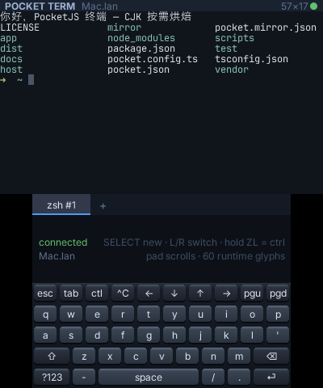
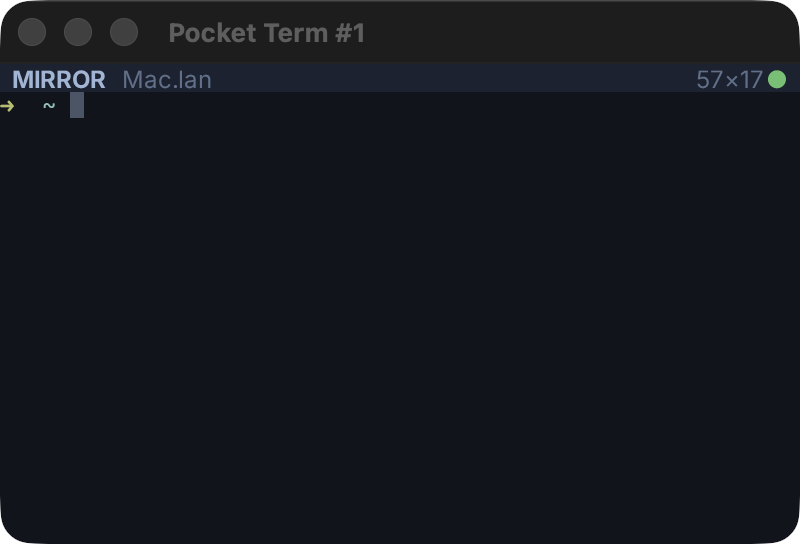
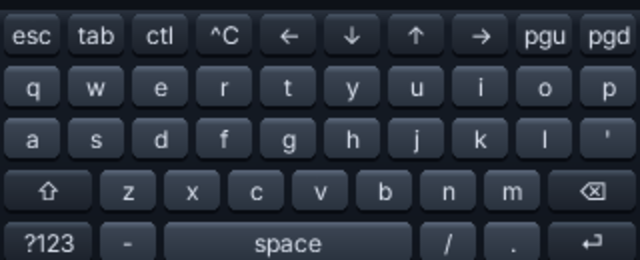

# Pocket Term

A remote terminal multiplexer for the **Nintendo 3DS**. Your shells run on the
Mac; the console is a replica of one of them, drawn at 57×17 on the top screen
with a touch keyboard on the bottom.



The handheld runs no shell and owns no terminal state. A companion daemon on
the Mac owns the PTYs and one authoritative
[libghostty](https://github.com/ghostty-org/ghostty) core per session, resolves
every SGR sequence to concrete RGB, and sends the console rows of coloured
cells. The console sends keys back. That split is what lets a handheld from 2011
sit in front of a modern terminal program — including one whose UI is mostly
box drawing and CJK.

Built on [PocketJS](https://github.com/pocket-stack/pocketjs): the guest is a
Solid application compiled to a native package, and the same guest code draws
the mirror windows on macOS and Linux.

## How it works

```text
Mac (host/serve.ts, Node)                3DS (app/, PocketJS)
├─ node-pty        one PTY per session   ├─ Solid UI at 60 Hz, 57×17 cells
├─ libghostty WASM the authoritative     ├─ passive replica: applies row
│                  screen + scrollback   │   diffs, never interprets escapes
├─ resolves SGR → 0xRRGGBB runs          ├─ touch keyboard, one contact
├─ bakes glyphs the device lacks into    ├─ tabs: SELECT new, L/R switch,
│  spare font slots, streams them        │   long-press-and-slide to close
└─ opens one mirror window per session   └─ hold ZL for Ctrl (New 3DS)
        │                                          │
        └────────── SVC WIRE (PKNT) over TCP ──────┘
             UDP 8621 beacon carries the TCP port
```

**The console is a replica, not a client.** On attach it gets a full snapshot;
after that, ordered row diffs behind a `gen`/`seq` fence. A replica that misses
a sequence asks for a resync rather than guessing, so a dropped frame can never
leave the screen subtly wrong — the failure mode of a terminal that reconnects
into the middle of a stream.

**Glyphs arrive at runtime.** The app ships baked Latin and the full
U+2500–U+259F box and block ranges. Anything else a session prints — CJK,
`⏺`, `⎿` — is rasterized on the Mac into a font atlas for one of the device's
spare slots and streamed over the same wire, advances rewritten so a
double-width character lands on two columns.

**One window per session on the Mac.** Each is the mirror guest (`mirror/`)
running on the stock PocketJS desktop host, attached to the same daemon over
the same protocol as the console. It is a second replica, not a second
implementation: `app/grid.tsx` draws both. Typing into it goes to the same PTY.



## The keyboard



The bottom screen is a resistive panel that reports one contact, so the
keyboard is built around the phone conventions that work with a single finger:
one-shot Shift and Ctrl, a layer key for symbols, and an action strip for the
keys a terminal needs (Esc, Tab, ^C, arrows, paging). Keys are caps set into
sockets; pressing sinks the cap and turns its light around.

Hardware buttons cover what you reach for most: **A** Enter, **B** Backspace,
**X** Tab, **Y** Space, **START** ^C, **SELECT** a new session, **L/R** switch
sessions, the d-pad scrolls history, and **ZL held** is Ctrl (ZL comes from
`ir:rst`, so it needs a New 3DS or a Circle Pad Pro).

## Requirements

- A 3DS running the Homebrew Launcher, on the same network as the Mac
- [Bun](https://bun.sh) and **Node ≥ 23.6** (the daemon runs under Node: Bun's
  `node-pty` spawn helper hangs on macOS 26)
- Docker, for the devkitARM half of the 3DS toolchain (fetched on first build)
- The PocketJS checkout comes with the repository as `vendor/pocketjs`

## Quick start

```sh
git clone --recursive https://github.com/pocket-stack/pocket-term
cd pocket-term
bun run setup                     # vendor install, runtime links, daemon deps

bun run 3ds                       # → dist/3ds/pocketterm-main.3dsx
# copy it to the SD card under /3DS/ and launch it from the Homebrew Launcher

bun run daemon                    # the Mac side: PTYs, terminal cores, beacon
```

The console discovers the daemon by its UDP beacon and connects. The daemon
takes `--port`, `--beacon-port`, `--name`, `--shell`, `--no-mirror` and
`--unicast <ip>` — the last beacons directly at a console on a network that
eats broadcast.

To iterate on the app without reflashing, pair once while the console is
running ftpd, then hot-push the guest package:

```sh
bun run pair --host 192.168.8.152   # once, with ftpd open on the console
bun run push --host 192.168.8.152   # rebuild + push; the app keeps running
bun run probe --host 192.168.8.152  # status, stats, tree, screenshot
```

A change under `vendor/pocketjs/hosts/3ds` is native and needs `bun run 3ds`
plus a reflash; everything in `app/` and `mirror/` is a hot push.

## Layout

```text
app/       the console guest — grid, tabs, touch keyboard, replica store
mirror/    the desktop guest — the same grid, one window per session
host/      the Mac daemon — PTYs, libghostty cores, glyph baking, the wire
test/      protocol, run-building and glyph-routing tests (bun run check)
scripts/   build and device commands over the vendored PocketJS toolchain
```

`app/protocol.ts` is the contract both sides read: message shapes, the run
encoding, and which codepoints the device can already draw.

## Status

`vendor/pocketjs` pins merged PocketJS main at `10aee589`. It includes the
3DS companion transport, per-app recovery storage and the current HBL icon.
**The build embeds independently drawn 24×24 and 48×48 icons**, using the
same assets as Pocket Doc. Its runtime state lives under
`/pocketjs/runtime/apps/22a222ca7b6bddb1/`; hold **L+R+START** to return to HBL.

See [runtime upgrade validation](docs/RUNTIME-UPGRADE.md) for the checks and
deployment receipt for this pin.

## License

MIT. PocketJS is a separate project under its own license, and libghostty
arrives through [`@wterm/ghostty`](https://www.npmjs.com/package/@wterm/ghostty)
under its own.
