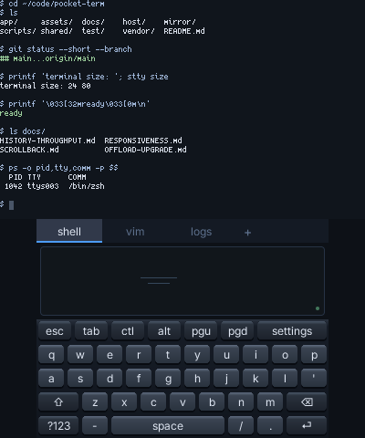
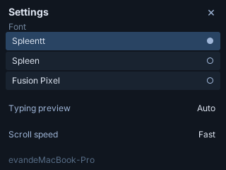

# Pocket Term

Pocket Term is a **Nintendo 3DS terminal client for macOS**. Open independent
shell sessions, switch between them, edit in Vim or Nano, and read scrollback
with the Circle Pad or a touchpad. Each session can also open a Mac mirror
window connected to the same PTY.

The top screen uses its full **400×240 pixels for 80 columns × 24 rows**.
The lower screen contains session tabs, a scroll touchpad and a keyboard;
font, scroll speed and typing preview controls live in settings.



Native 3DS rendering captured in Azahar with deterministic example terminal
data. The two screens retain their native pixel dimensions. Capture commands
and provenance are in [screenshots](docs/screenshots/README.md).

## What it supports

- **Multiple real shells.** Up to 32 macOS PTYs, paged session tabs, ANSI color,
  alternate screens, terminal cursor keys and explicit bracketed paste.
- **Local inertial scrollback.** Pixel movement continues while history loads.
  A bounded 3DS cache retains fetched rows; missing rows show placeholders.
  The Mac retains up to 2,000 history rows per session.
- **Hardware cursor control.** The D-pad and right nub send repeating terminal
  arrows, including application cursor mode for editors such as Vim and Nano.
- **Selectable bitmap fonts.** Spleentt 5×8, Spleen 5×8 and Fusion Pixel 10px
  preserve their original pixels. ASCII occupies 5px; wide characters occupy
  two columns. The Mac supplies glyphs missing from the baked atlas.
- **Provisional input preview.** After observing matching application echoes,
  the client can show pending text or cursor movement before its reply arrives.
  The preview never changes the actual terminal grid or executes a command.

## Build and connect

Use a Mac and a homebrew-capable 3DS on the same local network. The console
needs Homebrew Launcher and ftpd. Building requires Bun, Node, Rust through
rustup, and a running Docker engine. CI uses **Bun 1.3.14 and Node 24**;
`bun run daemon` starts the Node supervisor and its Bun offload provider.

PocketJS is pinned as the `vendor/pocketjs` submodule. Its
[Rust toolchain file](vendor/pocketjs/hosts/3ds/core/rust-toolchain.toml) selects
the nightly used by the 3DS build; the build script drives the devkitARM
container. Install that pinned toolchain with its `rust-src` component if
rustup has not already provisioned it.

```sh
git clone --recursive https://github.com/pocket-stack/pocket-term
cd pocket-term
bun run setup
bun run 3ds
bun run mirror
```

Keep `~/.cargo/bin` on `PATH`. `mirror` builds the optional Mac window; use
`--no-mirror` when starting the daemon if you do not want desktop windows.

Start ftpd on the console, then replace the example IP with the address
shown by ftpd:

```sh
bun run deploy --host 192.168.8.102
```

The deploy command installs `dist/3ds/pocketterm-main.3dsx` at
`/3DS/pocketterm-main.3dsx`, provisions this app's offload key, backs up the
previous launcher, and downloads the installed files to verify their bytes.
The default FTP port is 5000; use `--ftp-port` if yours differs.

**Exit ftpd and launch Pocket Term from Homebrew Launcher.** Start the Mac
companion with the same console address:

```sh
bun run daemon --device 192.168.8.102
```

Keep the companion running while using the terminal. It starts a shell for
the first device connection and opens a mirror for each session when the
mirror build is available. Useful options are:

| Option | Purpose |
| --- | --- |
| `--cwd /path/to/project` | Working directory for new shells |
| `--shell /bin/zsh` | Shell executable |
| `--no-login` | Start the shell without login mode |
| `--no-mirror` | Use the handheld without opening Mac windows |
| `--name name` | Companion name |
| `--key /path/to/key` | Pairing key; defaults to `.pocket/offload.key` |
| `--trace` | Log command kinds and session changes, without typed text |

`--unicast` is an alias for `--device`. The pairing key belongs to this app;
keep the Mac's `.pocket/offload.key` when updating an existing installation.

**A Wi-Fi or provider reconnect preserves PTYs while the Node worker remains
alive. Stopping the companion ends its sessions.** Reconnect persistence is
in memory and does not restore shells after a Mac or daemon restart.

## Controls and settings

| Control | Action |
| --- | --- |
| A / B / X / Y | Enter / Backspace / Tab / Space |
| D-pad | Terminal cursor arrows, with repeat |
| Circle Pad / touchpad drag and flick | Scroll local history with inertia |
| Right nub, where supported | Repeating editor cursor arrows |
| START | Ctrl-C |
| SELECT / touch `+` | Open a session |
| L / R | Previous / next session |
| Touch a tab | Attach to that session |
| Hold a tab, slide down, release | Close the selected session |
| Touch page arrows | Page through session tabs |
| Hold ZL, where supported | Ctrl modifier |
| `?123` → `#{~` → `F1+` | Symbols, function keys and navigation keys |
| Keyboard `settings` key | Choose font, typing preview and scroll speed |
| L + R + START | Return to Homebrew Launcher |

The touch keyboard provides Shift, Ctrl and Alt. The hardware arrows replace
touch arrow keys. Mac mirrors accept keyboard input and paste into their
assigned session; session creation, closing and switching belong to the 3DS.



Spleentt is the default face, padded to a 5×10 cell. Settings apply during the
current app run. Preview can be disabled; it does not predict wrapping, wide
glyphs, completion or control-key actions. Its 350ms expiry and two-second
confidence window use **PocketJS virtual time**, so pausing frame progression
also pauses these display deadlines. See [prediction and input delivery](docs/RESPONSIVENESS.md)
for the confirmation rules and measured queue behavior.

## Architecture

```text
3DS UI and bounded row cache
        │ paired PocketJS io.offload
        ▼
Bun provider worker ── authenticated loopback ── Node terminal worker
                                                 ├─ PTYs + libghostty
                                                 ├─ session and history registry
                                                 ├─ dynamic glyph rasterization
                                                 └─ session-specific Mac mirrors
```

**The Node worker owns terminal state; the 3DS owns presentation and input.**
The handheld does not spawn processes, parse terminal escape sequences or
rasterize outline fonts. PocketJS delivers asynchronous results at frame
boundaries. Complete grid generations commit together; historical rows are
published into a bounded cache with a separate per-frame work limit.

Three independent request paths keep input responsive:

| Request | Contract |
| --- | --- |
| `term.input` | Ordered input batches with command ids; lost replies retry the same ids |
| `term.exchange` | Live grid and glyph fragments retained until acknowledged |
| `term.history.batch` | Up to 16 historical rows per request, with two requests in flight |

An output reply cannot hold the input ticket. Cache keys include the session,
history epoch and absolute row; reset, pruning and alternate-screen transitions
fence stale results. A changed replica epoch discards uncertain input and
requests a fresh screen. Already cached history remains readable while offline.

The guest retains up to **192 historical rows** and **64 queued commands**.
Paste is limited to 8,192 UTF-16 code units. These bounds and the pinned
runtime's one-record-per-frame delivery limit are documented in
[cache synchronization](docs/SCROLLBACK.md) and
[history throughput](docs/HISTORY-THROUGHPUT.md). They do not imply a physical
Wi-Fi throughput or a guaranteed frame rate.

The provider ownership follows [Pocket Doc](https://github.com/pocket-stack/pocket-doc).
Public PocketJS APIs own runtime, input and host operations; Solid owns
reactivity. Product protocol and budgets live in `shared/`, the handheld in
`app/`, and terminal capabilities in `host/`. Mac mirror listeners bind only
to loopback; LAN terminal access uses paired offload.

## Updating and troubleshooting

Pull the latest main, update the submodule, run setup and rebuild:

```sh
git pull --ff-only
git submodule update --init
bun run setup
bun run 3ds
bun run mirror
```

Then exit Pocket Term, start ftpd, and run `deploy` again. **The offload
launcher boots its embedded package**, so updates require replacing the
`.3dsx`. The old `push` and `probe` commands apply to the earlier svc launcher.
Upgrade the guest and companion together when the protocol changes; current
builds use **protocol 6**. The old svc key does not replace the offload key.

If the device stays disconnected, check that ftpd has exited, the companion
uses the console's current IP, and `.pocket/offload.key` matches the deployed
key. Return to HBL with L + R + START before transferring another build.
The app's runtime storage is isolated under
`/pocketjs/runtime/apps/22a222ca7b6bddb1/`.

## Development and validation

```sh
bun run check                # guest/host types and terminal unit tests
bun run test:pty             # actual providers, macOS PTYs and VT behavior
bun scripts/font.ts --check  # reproduce all three shipped bitmap atlases
bun run visual --showcase    # build the documentation capture fixture
bun run visual --showcase --settings
bun run visual --history --motion
bun run visual --preview
```

Visual builds use a separate app id and `pocketterm-qa.3dsx` launcher. The
[screen captures](docs/screenshots/README.md) use the native renderer with
controlled data; `test:pty` separately exercises real providers, shells,
reconnects, history and saved Vim/Nano edits.

The deployed protocol-6 build has been accepted in user testing. Reproducible
checks, deployment hashes and the revision history are recorded in
[validation](docs/OFFLOAD-UPGRADE.md). Simulated latency and emulator captures
remain distinct from physical timing measurements.

## License

MIT. PocketJS, libghostty and the fonts retain their own licenses.
[Font sources](assets/fonts/README.md) records pinned upstream versions,
licenses and original-byte hashes. BDF sources are stored as lossless gzip
archives and decoded by build tools and the Mac host.
