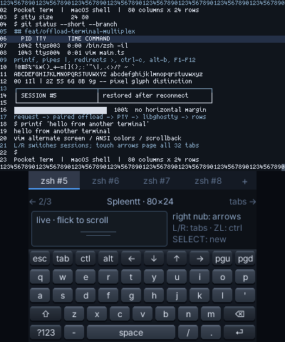

# Pocket Term

Pocket Term controls **macOS PTY sessions from a Nintendo 3DS**. The top
screen displays **80 columns × 24 rows**, using a **5px monospace advance
and 10px row height** across its entire 400×240 display. The touch screen
contains session tabs, a scroll touchpad and the keyboard. Fonts, input
preview and scroll speed are selected in its settings panel.



This screenshot uses a deterministic fixture in Azahar. It verifies the
native renderer and layout; it is separate from physical device acceptance.

## Architecture

The paired connection uses PocketJS's **io.offload** service. Following
[Pocket Doc](https://github.com/pocket-stack/pocket-doc/tree/edd774b)'s provider
pattern, the handheld performs no filesystem, PTY, terminal parsing or font
rasterization work. Its visible rows and delivery queues have fixed limits.

```text
3DS Solid UI → PocketJS offload → Bun provider worker
                                  ↓ authenticated loopback capability
                           Node terminal worker
                           ├─ session registry + bounded replica queues
                           ├─ node-pty + libghostty per session
                           ├─ scrollback + dynamic glyph rasterization
                           └─ loopback PocketJS desktop mirrors
```

**The Node terminal process owns sessions across provider reconnects.**
PocketJS destroys a connection's provider worker on disconnect; the separate
Node process keeps the PTYs and terminal state. Node is also required by
node-pty on macOS. The supervisor starts both processes and closes their
children when it exits.

**Each input command carries a monotonically increasing id.** A lost reply
can be retried with the same id. The terminal worker consumes it once. Input batches and screen pulls use
independent offload requests; each output fragment is retained until the
guest acknowledges it. A changed
worker or replica epoch discards uncertain input and resets the grid.
Screen output coalesces while delivery is pending; terminal bytes continue
to feed libghostty on the Mac. Completed grid updates commit together.

The shared protocol is in `shared/protocol.ts`; geometry and queue budgets
are in `shared/layout.ts` and `shared/exchange.ts`. The live terminal stream
uses ordered delivery. Historical rows use a separate bounded local cache;
[history synchronization](docs/SCROLLBACK.md) specifies row identity, epoch
fences, offline behavior and glyph residency. [History throughput](docs/HISTORY-THROUGHPUT.md)
explains grouped reads, frame budgets and measured cold-cache filling.

**Desktop mirrors share the same PTY and grid renderer.** Each window gets
a dedicated loopback listener bound to its session, so concurrent window
startup cannot exchange sessions. Mirrors accept keyboard input and paste;
they do not open, close, resize or switch sessions. No terminal listener is
exposed on the LAN. The 3DS connects through its app-specific pairing key.

## Controls

| Control | Action |
| --- | --- |
| A / B / X / Y | Enter / Backspace / Tab / Space |
| D-pad | Terminal arrows, with repeat |
| Circle pad / touchpad flick | Local inertial scrollback |
| Right nub (supported hardware) | Repeating editor cursor arrows |
| Keyboard settings key | Fonts, provisional typing preview and scroll speed |
| START | Ctrl-C |
| SELECT / touch + | New session |
| L / R | Previous / next session |
| Hold ZL | Ctrl on supported hardware |
| Touch tab | Attach to that session |
| Hold tab, slide down, release | Close that session |
| Touch page arrows | Navigate all session tabs |
| `?123` → `#{~` → `F1+` | Function keys, Insert, Delete, Home and End |

Shift, Ctrl and Alt can be armed on the touch keyboard. Named keys preserve
modifiers and application cursor mode; shifted Tab sends back-tab. Desktop
paste is explicit and buffered until complete, with bracketed paste markers
when the foreground program requests them. Typing multiple characters is
never interpreted as an implicit paste.

The companion supports **32 sessions**, **8 offload replicas**, and
**2,000 scrollback rows per session**. Each guest queues at most 64 commands
with one input batch and one screen pull in flight. Paste is bounded to 8,192 UTF-16 code units;
a batch that does not fit is rejected before sending any of it. The Mac
retains at most 256 Ki characters of output per replica. Inactive replicas
expire after 30 minutes. At capacity, a replica idle for 15 seconds may be
evicted to admit a reloaded guest; its PTYs remain in the session registry.

## Setup

The runtime pin is PocketJS main `1c0735fa`. Install Bun, Node ≥23.6, Docker
and the PocketJS pinned Rust toolchain.

```sh
git clone --recursive https://github.com/pocket-stack/pocket-term
cd pocket-term
bun run setup
PATH="$HOME/.cargo/bin:$PATH" bun run 3ds
bun run mirror

# Run ftpd on the 3DS for pairing and SD-card installation.
bun run deploy --host 192.168.8.152
# Backs up the old launcher, provisions its offload key, verifies FTP readback.
# Exit ftpd, launch Pocket Term, then start the paired Mac provider:
bun run daemon --device 192.168.8.152
```

`--unicast <ip>` remains an alias for `--device <ip>`. It now selects the
paired offload destination instead of broadcasting a beacon. The supervisor
also accepts `--key <file>` (default `.pocket/offload.key`), `--name`,
`--shell`, `--cwd`, `--no-login`, `--no-mirror`, and `--trace`. The trace
records command kinds and session changes without recording typed text. Without a device address,
it starts only the local terminal service. Pairing keys stay in ignored
files and are not printed in receipts.

**Upgrading the previous svc build requires a new .3dsx installation and
an offload key.** Its earlier development-service key does not enable the
new transport. The app's runtime remains isolated at
`/pocketjs/runtime/apps/22a222ca7b6bddb1/`; L+R+START returns to HBL.

The pinned 3DS offload host boots its embedded package and does not run the
legacy development server. **Updates require rebuilding and replacing the
.3dsx through ftpd.** `push` and `probe` remain legacy svc-build tools; they
cannot update or inspect this offload launcher.

## Validation

```sh
bun run check               # guest + host types, explicit unit tests
bun run test:pty            # real provider workers, reconnects, PTYs and VT
bun scripts/font.ts --check # deterministic shipped 5px atlas
bun run 3ds                # production native build
bun scripts/visual.ts      # separate native capture fixture
```

`test:pty` uses temporary files and shells. It runs the actual PocketJS
provider and capability worker against a simulated native socket endpoint,
then exercises the real Node PTYs and libghostty. The native capture fixture
uses `pocketterm-qa.3dsx`; it never replaces the production launcher.

See [input responsiveness](docs/RESPONSIVENESS.md) for the latency mechanism
and prediction limits, and [upgrade validation](docs/OFFLOAD-UPGRADE.md) for results and the current
physical acceptance boundary. [Earlier runtime validation](docs/RUNTIME-UPGRADE.md)
records the previous 57×17 svc build, not this upgrade.

## License

MIT. PocketJS, libghostty and font sources retain their own licenses.
[Font sources and derivation](assets/fonts/README.md) lists Spleen and Spleentt
under BSD-2-Clause, Fusion Pixel and JetBrains Mono under SIL OFL.
The default terminal face is Spleentt 5×8, padded to a 5×10 cell.
